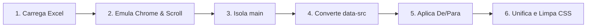

# 🚀 Extrator e Automatizador de Landing Pages - Xiaomi Global

Ferramenta desenvolvida em Python para automatizar a extração de landing pages do site global da Xiaomi conforme demandas da engenharia. 

O script contorna bloqueios de segurança (Akamai WAF), isola o conteúdo principal (`<main>`), unifica folhas de estilo CSS, normaliza e realiza a tradução automática via planilha Excel (`en-US` ➔ `pt-BR`) e gera versões independentes para Desktop e Mobile.

## 📋 Requisitos

Antes de executar o projeto, certifique-se de ter instalado em sua máquina:
* **Python 3.8+**
* **Google Chrome**

## 🔧 Instalação

Abra o seu terminal (Git Bash, WSL, Prompt de Comando ou PowerShell) e siga os passos abaixo:

### 1. Instalar as bibliotecas Python
```bash
pip install playwright beautifulsoup4 pandas openpyxl
```

### 2. Instalar o navegador Chromium do Playwright
Para garantir a compatibilidade com o ecossistema do Playwright, rode:
```bash
playwright install chromium
```

## 📂 Estrutura do Projeto

Organize os arquivos da seguinte forma na pasta do seu projeto:

```plaintext
meu-projeto/
├── lp_extract.py       # Script principal em Python
├── traducao.xlsx       # Planilha com as traduções de/para (Opcional)
└── README.md           # Este guia
```

### Formato da Planilha `traducao.xlsx`
A planilha deve conter duas colunas na primeira aba configuradas deste modo:

| en-US | pt-BR |
| :--- | :--- |
| Text in English | Texto em Português |

## 💻 Como Rodar no VS Code

1. **Abrir o projeto:** Abra o VS Code, vá em `File > Open Folder...` e escolha a pasta do projeto.
2. **Configurar a URL alvo:** Abra o arquivo `lp_extract.py` (ou `extrair_landing.py`) e altere as variáveis de configuração:
   ```python
   URL_ALVO = "https://mi.com...."
   NOME_PRODUTO = "nome_que_sera_colocado_na_pasta_principal"
   ```
3. **Executar o Script:** Rode o arquivo `lp_extract.py`.

> ⚠️ **Atenção:** Uma janela do Google Chrome será aberta automaticamente. Não a feche manualmente; o script a utilizará para simular a navigation humana e fechará sozinho ao concluir.

## ⚙️ Pipeline de Execução

O script executa um fluxo automatizado dividido em 6 etapas principais:



## 🌐 Estruturas de HTML Geradas

O motor de raspagem lida com as tags do ecossistema original e padroniza as saídas puras de acordo com as especificações abaixo:

### 📥 Exemplo de Estrutura Inicial (Origem Xiaomi Global)
O script localiza a árvore estrutural complexa e mapeia os atributos Lazy Loading dinâmicos de imagens:
```html
<main class="xiaomi-lp-container">
  <!-- O script irá capturar apenas o bloco interno de main, ignorando headers e footers gerais da Mi -->
  <section class="section-product-hero">
    <h2 class="title">Original English Title Here</h2>
    <!-- Imagens protegidas por data-src que causam quebras são mapeadas automaticamente -->
    
  </section>
</main>
```

### 📤 Exemplo de HTML de Saída Purificado (`index.html`)
Após passar pelas etapas de tratamento e tradução via Excel, o arquivo final gerado em `pagina_extraida/` adota o seguinte formato limpo e traduzido:
```html
<!DOCTYPE html>
<html lang="pt-BR">
<head>
  <meta charset="UTF-8">
  <meta name="viewport" content="width=device-width, initial-scale=1.0">
  <title>Landing Page Extraída</title>
  <link rel="stylesheet" href="style.css">
</head>
<body>
  <!-- Conteúdo extraído isolado e traduzido de forma automatizada -->
  <main class="xiaomi-lp-container">
    <section class="section-product-hero">
      <h2 class="title">Título Traduzido em Português Aqui</h2>
      <!-- data-src normalizado e injetado diretamente no atributo src principal -->
      
    </section>
  </main>
</body>
</html>
```

## 📁 Resultado Gerado

Após a finalização, o script criará a pasta `pagina_extraida/` na raiz do projeto com a seguinte estrutura pronta para publicação:

```plaintext
pagina_extraida/
├── desktop/
│   ├── index.html     # Estrutura HTML limpa, traduzida e contendo apenas a tag <main>
│   └── style.css      # Folha de estilo consolidada e corrigida
└── mobile/
    ├── index.html     # Versão otimizada para dispositivos móveis
    └── style.css      # Folha de estilo otimizada para dispositivos móveis
```
